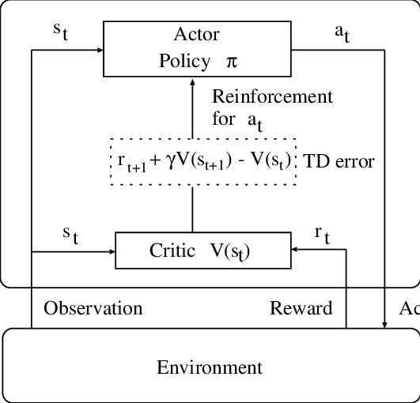
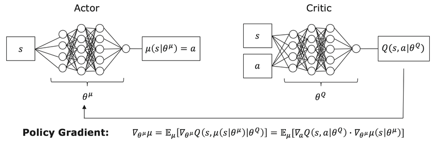
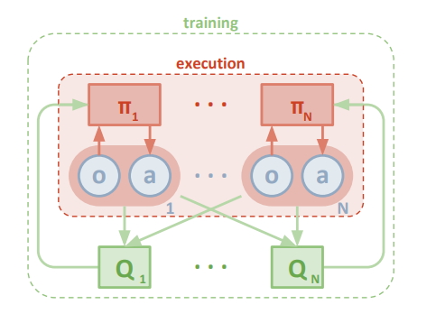
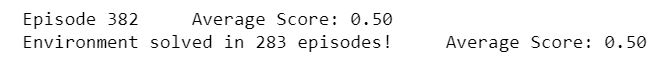
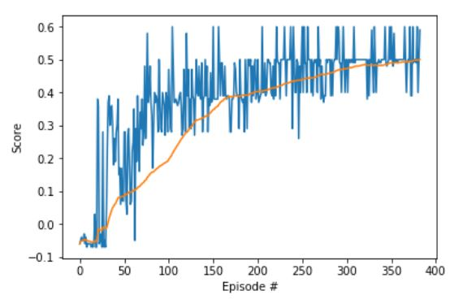

# Playing Tennis Project Report 
The objective of this project is to train two reinforcement learning agents to play a tennis game in a given (virtual) world. 
The agents control rackets to bounce a ball over a net. Thus, the goal of each agent is to keep the ball in play.

An actor-critc approach is used to learn the optimal policy using multi-agent deep deterministic policy gradient. 
An actor-critic agent uses function approximation to learn a policy and a value function. So, two neural networks are used, 
one for the actor and the other for the critic. The figure below shows the flow diagram of actor critic methods: 



Figure [reference](https://www.researchgate.net/publication/221485561_Automatic_speech_recognition_based_on_adaptation_and_clustering_using_temporal-difference_learning)

## Learning Algorithm 
The implementation of MADDPG agent is organized in three main files:  
- `Tennis.ipynb` where the environment setting, agent initalization, and trainging management are executed. 
- `ddpg_agents.py` where the learning agent is defined
- `model.py` where the neural network is defined

### Algorithm 
The work in this project is part of the provided framework by Udacity implementing the DDPG algorithm. 
The DDPG is a different type of actor-critic methods. Actually, it could be seen as an approximate DQN since the critic 
in DDPG is used to approximate the maximizer over the Q-values of the next state. DDPG is best classified as a DQN method for continuous action spaces.



Figure [reference](https://www.researchgate.net/publication/322879739_Deep_Reinforcement_Learning_for_Advanced_Energy_Management_of_Hybrid_Electric_Vehicles)

In this project we implement a multi-agent DDPG with shared replay buffer. Each agent has its own local actor and critic networks 
and act based on its observations only. However the experiences of both agents are stored in the same replay buffer to be used in 
learning the optimal policy of the other agent. The learning of each agent policy occurs as in the conventional DDGP. The figure below shows the MADDPG.



Figure [reference](https://medium.com/brillio-data-science/improving-openai-multi-agent-actor-critic-rl-algorithm-27719f3cafd4)

### Nework Architecture 
The designed neural network consists of a 24 dimension input layer, two hidden layers, and an output layer (with 2 outputs)
- First hidden layer: 
  - Input dimension: 24
  - Output dimension: 256 
  - Activation Function: ReLu 
- Second hidden layer: 
  - Input dimension: 256
  - Output dimension: 256 
  - Activation Function: ReLu
- Output layer: 
  - Input dimension: 256
  - Output dimension: 2 
  - Activation Function: tanh (to limit the output between -1 and +1) 
  
This neural network is used in both actor and critic for both the two agents.

### Hyper parameters 
The algorithm uses the following parameters defined in `ddpg_agents.py` besides those passed to DDPG agents from `Tennis.ipynb`. 
- Learning parameters 
```
BUFFER_SIZE = int(1e6)  # replay buffer size
BATCH_SIZE = 128        # minibatch size
GAMMA = 0.99            # discount factor
TAU = 1e-3              # for soft update of target parameters
LR_ACTOR = 1e-4         # learning rate of the actor 
LR_CRITIC = 2e-4        # learning rate of the critic
WEIGHT_DECAY = 0        # L2 weight decay
```
- Iteration specs   
```
ddpg(n_episodes=2000, max_t=200, print_every=100)
```
The same parameters are used for the two agents. 

## Results: Average Reward 
The environment is solved if the average reward = +0.5 or greater over 100 successive epsiodes. 
The average reward is calculated based on the maximum reward between the two agents at every episode 

This result is achieved in the first 300 epsiodes at max_t = 200. For agent training performance, we plot the maximum rewards 
recieved by both agents at every episode (in blue), and the mean of the maximum rewards (over 100 episodes) at every episode (in orange) 




## Future work 
The work in this project may be extended to reach a better performance. Some of techniques that may be applied are discussed below: 
1. [A3C algorithm](https://arxiv.org/pdf/1602.01783.pdf): calculates the advantage function and the critic learns to estimate the value function using N-step bootstraping in training. It uses parallel training by creating multiple instances of the environment and agent and running them at the same time. 
This is suitable for the case of using multiple instances of each agent to learn the optimal policy and it eliminates the need of the replay buffer. 
2. [D4PG algoirthm](https://openreview.net/forum?id=SyZipzbCb): starts from the DDPG algorithm and includes a number of enhancements. These extensions include a distributional critic update,
the use of distributed parallel actors, N-step returns, and prioritization of the experience replay.
